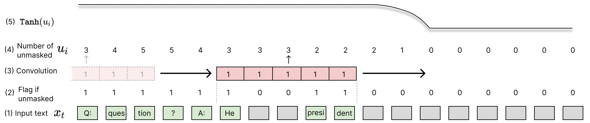

# Fast and Fluent Diffusion Language Models via Convolutional Decoding and Rejective Fine-tuning

**Yeongbin Seo,  Dongha Lee †, Jaehyung kim †, Jinyoung Yeo † **      ( †  indicates advisors)

---

### Abstract

Autoregressive (AR) language models generate text one token at a time, which limits their inference speed. Diffusion-based language models offer a promising alternative, as they can decode multiple tokens in parallel. However, we identify a key bottleneck in current diffusion LMs: the **long decoding-window problem**, where tokens generated far from the input context often become irrelevant or repetitive. Previous solutions like semi-autoregressive address this issue by splitting windows into blocks, but this sacrifices speed and bidirectionality, eliminating the main advantage of diffusion models. To overcome this, we propose **Convolutional decoding (*Conv*)**, a normalization-based method that narrows the decoding window without hard segmentation, preserving fluency and bidirectionality. Additionally, we introduce **Rejecting Rule-based Fine-Tuning (R2FT)**, a post-hoc training scheme that better aligns tokens at positions far from context. Our methods achieve state-of-the-art results on open-ended generation benchmarks (e.g., AlpacaEval) among diffusion LM baselines, with significantly lower step size than previous works, demonstrating both speed and quality improvements.

---

### Installation

```bash
CUDA 12.1
$ conda create --name conv python=3.9
$ conda activate conv
$ pip install torch==2.2.2 torchvision==0.17.2 --index-url <https://download.pytorch.org/whl/cu121>

$ pip install <https://github.com/Dao-AILab/causal-conv1d/releases/download/v1.1.3.post1/causal_conv1d-1.1.3.post1+cu122torch2.2cxx11abiFALSE-cp39-cp39-linux_x86_64.whl>

$ pip install datasets==2.18.0 einops==0.7.0 fsspec==2024.2.0 git-lfs==1.6 h5py==3.10.0 hydra-core==1.3.2 ipdb==0.13.13 lightning==2.2.1

$ pip install <https://github.com/state-spaces/mamba/releases/download/v1.1.4/mamba_ssm-1.1.4+cu122torch2.2cxx11abiFALSE-cp39-cp39-linux_x86_64.whl>

$ pip install notebook==7.1.1 nvitop==1.3.2 omegaconf==2.3.0 packaging==23.2 pandas==2.2.1 rich==13.7.1 seaborn==0.13.2 scikit-learn==1.4.0 timm==0.9.16 transformers==4.38.2 triton==2.2.0 wandb==0.13.5

$ pip install <https://github.com/Dao-AILab/flash-attention/releases/download/v2.5.6/flash_attn-2.5.6+cu122torch2.2cxx11abiFALSE-cp39-cp39-linux_x86_64.whl>

$ pip install bitsandbytes==0.42.0 git+https://github.com/huggingface/peft.git

```

---

### Quick generation with convolutional decoding

Generating responses with already fine-tuned model from [2] (LLaDA-8B-Instruct, https://huggingface.co/GSAI-ML/LLaDA-8B-Instruct).

```
bash scripts/generate_large_inst.sh

```

This bash script contains the following command, which generate with ***Conv* (convolutional decoding).**

```bash
python gen2_answer_generation.py \\
init_from_checkpoint.init_file='' \\
+model_path=GSAI-ML/LLaDA-8B-Instruct \\
+decode_type=conv \\
+block_length=128 \\
+temperature=1 \\
+steps=128 \\
+gen_length=512 \\
sampling.topk_k=1 \\
+mask_id=126336 \\
sampling.alpha_on=0.9 \\
sampling.t_on=0.55 \\
sampling.t_off=0.9 \\
sampling.eta=0.02 \\
+cfg=0 \\
+remasking=low_confidence \\
+eos_fill=False \\
+category=large8B_trained_gsm8k \\
+eval_data=gsm8k \\
+generator="test" \\
master_port=65535 \\
+rand_value=111 \\
+batch_size=1

```

---

## Convolutional decoding



Implementation for convolutional decoding is in    `generate_yb > def _ddpm_convolutin_update'

```python
...
    log_p_x0 = _subs_parameterization(logits, x, mask_id)
    p_x0 = log_p_x0.exp()
    topk_p_x0, topk_p_x0_ind = p_x0.topk(k= k, dim=-1)
    masked = x == mask_id

    #### convolutional decoding
    ### s_i
    unmasked = ~masked   # [batch, len]
    input_seq = unmasked.float().view(masked.size(0),1,-1).to('cuda')  # [batch, 1 , len]
    conv0 = F.conv1d(input_seq, kernel, stride=1, padding=padding_size.item() ).squeeze(1) # [batch,len] # max : window size. / when there is a left condition, condition end value: middle value of window size (e.g., 6 out of 11)
    normed_conv0 = conv0  # decided not to normalize. Can handle with conv_mult instead.
    conved_s = F.tanh(normed_conv0 * conv_mult) # normalization term s  [1, len]

    ## compute s_norm_constant.----------------------------------
    # denominator: at each position, sum_k(topk) * s, then sum only over mask positions
    eps0 = 1e-12
    den_per_pos = (topk_p_x0.sum(dim=-1) * conved_s)  # [B, L]

    den = (den_per_pos * masked.float()).sum(dim=-1)  # [B]

    # numerator: total sum of masked_p_x0 = number of masked tokens
    num = masked.sum(dim=-1).float()                  # [B]

    # normalization constant per batch
    s_norm_constant = (num / (den + eps0)).unsqueeze(-1)   # [B,1]

    #-----------------------------------------------------------
    conved_s_normed =  conved_s * s_norm_constant   # [batch, len]
    p_x0 =  topk_p_x0 * conved_s_normed.unsqueeze(-1) # [batch, len, k] # since the normalizing term is j(candiate rank) agnostic, unsqueeze
    # normalization value is based on masked positions, but spread across entire p_x0 -> no change in total prob. sum since copy_flag will overwrite later

    q_xs = p_x0 * (move_chance_t - move_chance_s)
    # q_xs.shape
    ### q_xs[:, :, self.mask_index] = move_chance_s[:, :, 0]
    q_xs[:, :, -1] = move_chance_s[:, :, 0]  # changed to top k, so shape is k+1. Last column is mask.
    # print(topk_p_x0_ind)
    topk_p_x0_ind[:,:,-1] = mask_id  # also change the index
    # print(topk_p_x0_ind)
    sampled_ind = _sample_categorical_mdlm(q_xs, temperature)
    _x = torch.gather(topk_p_x0_ind, -1, sampled_ind.unsqueeze(-1)).squeeze(-1)
    copy_flag = (x != mask_id).to(x.dtype)
    return copy_flag * x + (1 - copy_flag) * _x
...

```

---

# Training

We provide code for SFT and RFT

### Tokenize datasets

First, the dataset is tokenized and saved.

```bash
python tr1_make_dataset.py \\
+model_type=small

python tr1_make_dataset.py \\
+model_type=large

python tr1_make_dataset.py \\
+model_type=llama

```

### Download checkpoints

For SFT and RFT, download the pretrained checkpoints as follows: the small model from [1] (https://drive.google.com/drive/folders/16LuuptK7Xfk-vzhQYZBZ0SA-B-BFluau), and the large model from [2] (https://huggingface.co/GSAI-ML/LLaDA-8B-Base).

For pretrained checkpoints for AR:  small model from **[1]**, and the large model is *LLaMA-3-8B-Base* (https://huggingface.co/meta-llama/Meta-Llama-3-8B).

### SFT

Commands for SFT.

```bash
bash scripts/sft_small.sh
bash scripts/sft_large.sh

```

This script contains the following command.

```bash
python tr2_finetune.py \\
data.tokenizer_name_or_path=gpt2 \\
lora.bool=False \\
finetune.bool=True \\
backbone=dit \\
wandb.name=ft_small \\
parameterization=subs \\
T=0 \\
model.length=1024 \\
eval.retokenize=True \\
save_weight_only=True \\
forward_type=ddpm \\
optim.lr=2.5e-5 \\
optim.weight_decay=0.1 \\
loader.global_batch_size=256 \\
lr_scheduler.num_warmup_steps=500 \\
sampling.predictor=ddpm \\
sampling.num_sample_log=6 \\
loader.batch_size=1 \\
loader.eval_batch_size=1 \\
finetune.attention_cover=response \\
finetune.dataset=src_data/ft_data/tokenized_alpaca_instruction \\
val_eos_off=False

```

### R2FT

Commands for R2FT with SFT checkpoints.

```bash
bash scripts/r2ft_small.sh
bash scripts/r2ft_large.sh

```

This script contains the following command.

```bash
python tr2_finetune.py \\
init_from_checkpoint.bool=True \\
init_from_checkpoint.init_file=outputs/ft_small.ckpt \\
data.tokenizer_name_or_path=gpt2 \\
lora.bool=False \\
finetune.bool=True \\
r2ft.bool=True \\
r2ft.gamma=0 \\
r2ft.beta_w=1 \\
r2ft.beta_l=1 \\
r2ft.beta_a=0.1 \\
backbone=dit \\
wandb.name=r2ft_small \\
parameterization=subs \\
T=0 \\
model.length=1024 \\
eval.retokenize=True \\
save_weight_only=True \\
forward_type=ddpm \\
optim.lr=2.5e-5 \\
optim.weight_decay=0.1 \\
loader.global_batch_size=256 \\
lr_scheduler.num_warmup_steps=500 \\
sampling.predictor=ddpm \\
sampling.num_sample_log=6 \\
loader.batch_size=1 \\
loader.eval_batch_size=1 \\
finetune.attention_cover=response \\
finetune.dataset=src_data/ft_data/tokenized_alpaca_instruction \\
finetune.valid_size=20 \\
val_eos_off=False

```

### Generate

```bash
bash scripts/generate_small_gen2.sh
bash scripts/generate_large_gen2.sh

```

(gen1_ ...py   is based on MDLM[1] code
gen2_ ...py is based on LLADA[2] code.
We recommend gen2 )

---

## Evaluation

The evaluation for AlpacaEval uses the code from the [3] (https://github.com/tatsu-lab/alpaca_eval).

The reference response for AlpacaEval is generated by an AR model of the same size as each baseline (182M and 8B), trained with SFT using the same hyperparameters, using *nucleus* decoding.

The evaluation for GSM8K is as following.

```bash
python eval_gsm8k.py \\
--eval_data=llada_inst_ddpm_conv_L1024_S128   # << model checkpoint name. i.e, subdir name in answer_generation/generated >>

```

---

### Copyright

These codes are based on the GitHub repository of MDLM [1] (https://github.com/kuleshov-group/mdlm) , and partially LLADA[2] (https://github.com/ML-GSAI/LLaDA).

---

## Reference

[1] Sahoo, Subham, et al. "Simple and effective masked diffusion language models." *Advances in Neural Information Processing Systems* 37 (2024)

[2] Nie, Shen, et al. "Large language diffusion models." *arXiv preprint arXiv:2502.09992* (2025).

[3]Dubois, Yann, et al. "Length-controlled alpacaeval: A simple way to debias automatic evaluators." *arXiv preprint arXiv:2404.04475* (2024).